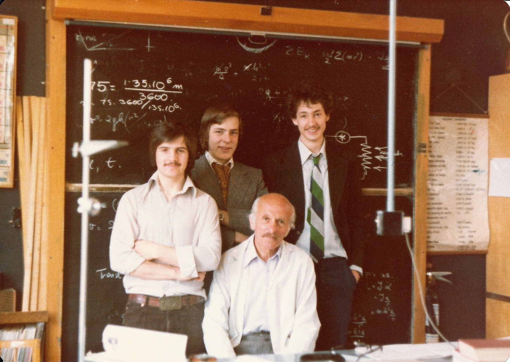

# A Simulation in C++ of Joseph Weizenbaum’s 1966 ELIZA

I’ve made in C++ what I think is an accurate simulation of the original ELIZA. It is a console application that takes as input the original format script file, which looks like a series of S-expressions, and then waits for the user to type a line of text before responding with a line of text of its own.

I believe it to be an accurate simulation of the original because I followed closely the description Weizenbaum gives in an article on page 36 of the January
1966 edition of Communications of the ACM titled *ELIZA - A Computer Program For the Study of Natural Language Communication Between Man And Machine*. When given the same prompts, this simulation reproduces exactly the conversation shown in the 1966 CACM article. The C++ source is [eliza.cpp](src/eliza.cpp) and a transcription of the original 1966 script file is [here](src/1966_01_CACM_article_Eliza_script.txt).

That’s it. Read on for fluf.

---

I believe I first read about ELIZA in 1978. My favourite teacher at secondary school was Alfred Nussbaum, who taught us physics. He knew of my interest in computers and suggested I read Joseph Weizenbaum’s book *Computer Power and Human Reason*.



Craig, Stuart and me with Alfred Nussbaum in the physics lab in Hengrove Comprehensive School, Bristol, England, 1979.

I recently found my copy of Mr. Weizenbaum’s book and reread it. He seemed to have a strong feelings about people who find computers fascinating.

>How may the compulsive programmer be distinguished from a merely dedicated, hard-working professional programmer? First, by the fact that the ordinary professional programmer addresses himself to the problem to be solved, whereas the compulsive programmer sees the problem mainly as an opportunity to interact with the computer. The ordinary computer programmer will usually discuss both his substantive and his technical programming problem with others. He will generally do lengthy preparatory work, such as writing and flow diagramming, before beginning work with the computer itself. His sessions with the computer may be comparatively short. He may even let others do the actual console work. He develops his program slowly and systematically. When something doesn’t work, he may spend considerable time away from the computer, framing careful hypotheses to account for the malfunction and designing crucial experiments to test them. Again, he may leave the actual running of the computer to others. He is able, while waiting for results from the computer, to attend to other aspects of his work, such as documenting what he has already done. When he has finally composed the program he set out to produce, he is able to complete a sensible description of it and to turn his attention to other things. The professional regards programming as a means toward an end, not as an end in itself. His satisfaction comes from having solved a substantive problem, not from having bent a computer to his will. [Computer Power and Human Reason, page 116]

The book contains many pages in this vein.

Does it matter *how* we accomplish things? Isn’t *what* we accomplish more important? (I’m not suggesting ends can always justify means.) If I do good work sitting at the computer, and you do good work sitting away from the computer, does it really matter? Or perhaps sometimes I do good work sitting at the computer, and sometimes I do good work while walking in the woods. Who cares?

On reflection, I’ve never solved a substantive problem in my life. I do get enjoyment out of bending a computer to my will - otherwise known as programming. It isn’t an academic exercise for me; I like making a machine do something useful or interesting. If there were no computers to execute my algorithms, I wouldn’t write them. I wonder if Weizenbaum would consider whatever problem ELIZA solves to be substantive.

People play and express themselves in many different mediums. Paint, clay, words, sound, theatre... I don’t see the harm in code being another medium in which one might immerse oneself.

Wikipedia says this is what Computer power and Human Reason is about:

>...while Artificial Intelligence may be possible, we should never allow computers to make important decisions because computers will always lack human qualities such as compassion and wisdom. Weizenbaum makes the crucial distinction between deciding and choosing. Deciding is a computational activity, something that can ultimately be programmed. Choice, however, is the product of judgment, not calculation. It is the capacity to choose that ultimately makes us human. Comprehensive human judgment is able to include non-mathematical factors, such as emotions. Judgment can compare apples and oranges, and can do so without quantifying each fruit type and then reductively quantifying each to factors necessary for comparison. \[[Wikipedia (11 Feb 2021)](https://en.wikipedia.org/wiki/Joseph_Weizenbaum)\]

I presume the distinction between deciding and choosing relates to the very old question about freewill and determinism. I don't believe in magic; I think we are subject to the laws of nature, and so we are deterministic. Choice maybe the product of judgment, but I think judgement must be the product of calculation (i.e. the deterministic behaviour of the particles that constitute our world).

I'm not 100% sure, but I think Weizenbaum would agree with this. For example, he says:

>Still, the extreme or hardcore wing of the artificial intelligentsia will insist that the whole man, to again use Simon's expression, is after all an information processor, and that an information-processing theory of man must therefore be adequate to account for his behavior in its entirety. We may agree with the major premise without necessarily drawing the indicated conclusion. We have already observed that a portion of the information the human "processes" is kinesthetic, that it is "stored" in his muscles and joints. It is simply not clear that such information, and the processing associated with it, can be represented in the form of computer programs and data structures at all.
>
>It may, of course, be argued that it is in principle possible for a computer to simulate the entire network of cells that constitutes the human body. But that would introduce a theory of information processing entirely different from any which has so far been advanced. Besides, such a simulation would result in "behavior" on such an incredibly long-time scale that no robot built on such principles could possibly interact with human beings. Finally, there appears to be no prospect whatever that mankind will know enough neurophysiology within the next several hundred years to have the intellectual basis for designing such a machine. We may therefore dismiss such arguments. [Computer Power and Human Reason, page 213]

Cf. the project to simulate a worm at the cellular level \[[Wikipedia](https://en.wikipedia.org/wiki/OpenWorm)\].

At other times I think Weizenbaum is saying it will never happen:

> But, and this is the saving grace of which an insolent and arrogant scientism attempts to rob us, we come to know and understand not only by way of the mechanisms of the conscious. We are capable of listening with the third ear, of sensing living truth that is truth beyond any standards of provability. It is *that* kind of understanding, and the kind of intelligence that is derived from it, which I claim is beyond the abilities of computers to simulate. [Computer Power and Human Reason, page 222]

I think Weizenbaum is saying science can never fully model what it is to be a human being and "there are objectives that are not appropriately assignable to machines” [page 210]. This critic would not disagree. But I would have preferred him to have made this central point more straightforwardly and spent less time waffling and calling people names. (Please note that I don't claim to know what "listening with the third ear, of sensing living truth that is truth beyond any standards of provability" means.)

Whether we can simulate human intelligence or not, computers are powerful tools that can be used by people to solve difficult problems we almost certainly couldn't solve without them. Some of these solutions will be good for humanity and all life on Earth. Others, maybe not so much... This puts me in mind of the very old quip: *to err is human; to really foul things up requires a computer*.

Cf. James Lovelock's Novacene \[[Wikipedia](https://en.wikipedia.org/wiki/Novacene)\].

---

Rediscovering the book set me off looking for the original 1966 CACM article about ELIZA. Having found and read the article I thought, in the spirit of exploration,  it would be fun to recreate ELIZA for myself. 

The article describing how ELIZA works is mostly fairly clear, except for when it gets mysterious: “...and a certain counting mechanism is in a particular state...” But the description stretches over eight pages, and I found it harder than I expected to translate into code. I think a page of pseudocode would have made much of the text superfluous.

This is my recreation of the core ELIZA algorithm, from my understanding of Weizenbaum’s description. I did the actual console work myself.

```cpp
// produce a response to the given 'input' using the given 'rules'
std::string eliza(rulemap & rules, const std::string & input)
{
    // for simplicity, convert the given input string to a list of uppercase words
    // e.g. "Hello, world!" -> (HELLO , WORLD !)
    stringlist words(split(to_upper(input)));


    // scan for keywords [page 38 (c)]; build the keystack; apply word substitutions
    stringlist keystack;
    int top_rank = 0;
    for (auto word = words.begin(); word != words.end(); ) {
        if (punctuation(*word)) {
            // keep only the first clause to contain a keyword [page 37 (c)]
            if (keystack.empty()) {
                // discard left of punctuation, continue scanning what remains
                word = words.erase(words.begin(), ++word);
                continue;
            }
            else {
                // discard right of punctuation, scan is complete
                word = words.erase(word, words.end());
                break;
            }
        }

        const auto r = rules.find(*word);
        if (r != rules.end()) {
            const auto & rule = r->second;
            if (rule->has_transformation()) {
                if (rule->precedence() > top_rank) {
                    // *word is a keyword with precedence higher than the highest
                    // keyword found previously: it goes top of the keystack [page 39 (d)]
                    keystack.push_front(*word);
                    top_rank = rule->precedence();
                }
                else {
                    // *word is a keyword with precedence lower than the highest
                    // keyword found previously: it goes bottom of the keystack
                    keystack.push_back(*word);
                }
            }
            rule->apply_word_substitution(*word); // [page 39 (a)]
        }

        ++word;
    }

    auto memory_rule = get_rule<rule_memory>(rules, SPECIAL_RULE_MEMORY);
    if (keystack.empty()) {
        // a text without keywords; can we recall a MEMORY? [page 41 (f)]
        if (memory_rule->is_time_for_recollection())
            return memory_rule->recall_memory();
    }

    // build tag mapping so that e.g. tags[BELIEF] -> (BELIEVE FEEL THINK WISH)
    const tagmap tags(collect_tags(rules));

    // the keystack contains all keywords that occur in the given 'input';
    // apply transformation associated with the top keyword [page 39 (d)]
    while (!keystack.empty()) {
        const std::string top_keyword = pop_front(keystack);

        auto rule = rules.find(top_keyword);
        if (rule == rules.end())
            break; // e.g. could happen if a rule links to a non-existent keyword

        // try to lay down a memory for future use
        memory_rule->create_memory(top_keyword, words, tags);

        // perform the transformation for this rule
        std::string link_keyword;
        auto act = rule->second->apply_transformation(words, tags, link_keyword);

        if (act == rule_base::complete)
            return join(words); // decomposition/reassembly successfully applied

        if (act == rule_base::inapplicable)
            break; // no decomposition rule matched the input words

        if (act == rule_base::linkkey)
            keystack.push_front(link_keyword); // rule links to another; loop

        // (rule_base::newkey -> rule wants to try next highest keyword, if any)
        assert(act == rule_base::linkkey || act == rule_base::newkey);
    }


    // last resort: the NONE rule never fails to produce a response [page 41 (d)]
    auto none_rule = get_rule<rule_vanilla>(rules, SPECIAL_RULE_NONE);
    std::string discard;
    none_rule->apply_transformation(words, tags, discard);
    return join(words);
}
```

From [eliza.cpp](src/eliza.cpp).

Example build under Windows 10 with MS Visual Studio 2019 Community command line:


```text
**********************************************************************
** Visual Studio 2019 Developer Command Prompt v16.8.5
** Copyright (c) 2020 Microsoft Corporation
**********************************************************************
[vcvarsall.bat] Environment initialized for: 'x64'

C:\Program Files (x86)\Microsoft Visual Studio\2019\Community>cd C:\Eliza

C:\Eliza>dir /b
1966_01_CACM_article_Eliza_script.txt
eliza.cpp

C:\Eliza>cl /EHsc /W4 eliza.cpp
Microsoft (R) C/C++ Optimizing Compiler Version 19.28.29337 for x64
Copyright (C) Microsoft Corporation.  All rights reserved.

eliza.cpp
Microsoft (R) Incremental Linker Version 14.28.29337.0
Copyright (C) Microsoft Corporation.  All rights reserved.

/out:eliza.exe
eliza.obj

C:\Eliza>eliza
Usage: eliza <scriptfile>
  where <scriptfile> is in original 1966 ELIZA script format

C:\Eliza>eliza 1966_01_CACM_article_Eliza_script.txt
HOW DO YOU DO. PLEASE TELL ME YOUR PROBLEM

Men are all alike.
IN WHAT WAY

^C
C:\Eliza>
```


As I mentioned before, my ELIZA simulation reproduces the exact conversation shown in both the 1966 CACM article, and reproduced ten years later in Computer Power and Human Reason. To remind you, this is that conversation. ELIZA output in all caps.

```text
Men are all alike.
IN WHAT WAY
They're always bugging us about something or other.
CAN YOU THINK OF A SPECIFIC EXAMPLE
Well, my boyfriend made me come here.
YOUR BOYFRIEND MADE YOU COME HERE
He says I'm depressed much of the time.
I AM SORRY TO HEAR YOU ARE DEPRESSED
It's true. I am unhappy.
DO YOU THINK COMING HERE WILL HELP YOU NOT TO BE UNHAPPY
I need some help, that much seems certain.
WHAT WOULD IT MEAN TO YOU IF YOU GOT SOME HELP
Perhaps I could learn to get along with my mother.
TELL ME MORE ABOUT YOUR FAMILY
My mother takes care of me.
WHO ELSE IN YOUR FAMILY TAKES CARE OF YOU
My father.
YOUR FATHER
You are like my father in some ways.
WHAT RESEMBLANCE DO YOU SEE
You are not very aggressive, but I think you don't want me to notice that.
WHAT MAKES YOU THINK I AM NOT VERY AGGRESSIVE
You don't argue with me.
WHY DO YOU THINK I DON'T ARGUE WITH YOU
You are afraid of me.
DOES IT PLEASE YOU TO BELIEVE I AM AFRAID OF YOU
My father is afraid of everybody.
WHAT ELSE COMES TO MIND WHEN YOU THINK OF YOUR FATHER
Bullies.
DOES THAT HAVE ANYTHING TO DO WITH THE FACT THAT YOUR BOYFRIEND MADE YOU COME HERE
```

Having fed in the above prompts and received the expected responses, I thought I’d try to play the part of the “young lady” and continue this original 1966 conversation.

```text
I know my boyfriend loves me and is just trying to help.
WHY DO YOU SAY YOUR BOYFRIEND LOVES YOU AND IS JUST TRYING TO HELP
I didn't really come here because my boyfriend is a bully.
DOES THAT SUGGEST ANYTHING ELSE WHICH BELONGS TO YOU
That's a funny question.
I AM NOT SURE I UNDERSTAND YOU FULLY
Let's start again. I'm depressed and I need your help.
WHY DO YOU WANT MY HELP
Because I can't seem to get out of my spiral of depression on my own.
IS IT IMPORTANT TO YOU THAT YOUR SPIRAL OF DEPRESSION ON YOUR OWN
You mean, is it important to me that I'm depressed? Of course it is.
WE WERE DISCUSSING YOU - NOT ME
I know we were.
YOU SAY YOU KNOW WE WAS
I don't think English is your first language.
DON'T YOU REALLY THINK ENGLISH IS MY FIRST LANGUAGE
I'm sorry, I didn't mean to be rude.
IS IT BECAUSE YOU ARE SORRY THAT YOU CAME TO ME
I already told you, I'm depressed and my boyfriend thought I should come see you.
PERHAPS IN YOUR FANTASY WE ALREADY TOLD EACH OTHER
Excuse me?
PLEASE GO ON
Look, aren't you going to ask me about my dreams or something?
WHAT DOES THAT DREAM SUGGEST TO YOU
You're not making sense.
DO YOU SOMETIMES WISH YOU WERE NOT MAKING SENSE
I can't say I ever have wished for that.
HOW DO YOU KNOW YOU CAN'T SAY YOU EVER HAVE WISHED FOR THAT
Because I have no memory of ever wishing to not make sense.
IS THAT THE REAL REASON
Dude, we're going in circles.
LETS DISCUSS FURTHER WHY YOUR MOTHER
Why my mother what?
TELL ME MORE ABOUT YOUR FAMILY
Is there any point?
WHAT DOES THAT SUGGEST TO YOU
It suggests to me that you are a giant electronic brain.
PERHAPS YOU WOULD LIKE TO BE A GIANT ELECTRONIC BRAIN
```

Eliza always has the last word.


```text
;
; APPENDIX. An Eliza Script
;
; Transcribed from Joseph Weizenbaum's article on page 36 of the January
; 1966 edition of Communications of the ACM titled 'ELIZA - A Computer
; Program For the Study of Natural Language Communication Between Man And
; Machine'.
;
; "Keywords and their associated transformation rules constitute the
; SCRIPT for a particular class of conversation. An important property of
; ELIZA is that a script is data; i.e., it is not part of the program
; itself." -- From the above mentioned article.
;
; Transcribed by Anthony Hay, December 2020
;
;
; Notes
;
; This is a verbatim transcription of the ELIZA script in the above
; mentioned CACM article, with the following caveats:
; a) Whitespace has been added to help reveal the structure of the
;    script.
; b) In the appendix six lines were printed twice adjacent to each other
;    (with exactly 34 lines between each duplicate), making the structure
;    nonsensical. These duplicates have been commented out of this
;    transcription.
; c) One closing bracket has been added and noted in a comment.
; d) There were no comments in the script in the CACM article.
;
;
; The script has the form of a series of S-expressions of varying
; composition. (Weizenbaum says "An ELIZA script consists mainly of a set
; of list structures...", but nowhere in the article are S-expressions or
; LISP mentioned. Perhaps it was too obvious to be noted.) Weizenbaum says
; ELIZA was written in MAD-Slip. It seems his original source code has
; been lost. Weizenbaum developed a library of FORTRAN functions for
; manipulating doubly-linked lists, which he called Slip (for Symmetric
; list processor).
;
; The most common transformation rule has the form:
;
;   (keyword [= replacement-keyword] [precedence]
;     [ ((decomposition-rule-0) (reassembly-rule-00) (reassembly-rule-01) ...)
;       ((decomposition-rule-1) (reassembly-rule-10) (reassembly-rule-11) ...)
;       ... ] )
;
; where [ ] denotes optional parts. Initially, ELIZA tries to match the
; decomposition rules against the input text only for the highest ranked
; keyword found in the input text. If a decomposition rule matches the
; input text the first associated reassembly rule is used to generate
; the output text. If there is more than one reassembly rule they are
; used in turn on successive matches.
;
; In the decomposition rules '0' matches zero or more words in the input.
; So (0 IF 0) matches "IF POSSIBLE" and "WHAT IF YOU DIE". Numbers in
; the reassembly rules refer to the parts of the decomposition rule
; match. 1 <empty>, 2 "IF", 3 "POSSIBLE" and 1 "WHAT", 2 "IF", 3 "YOU DIE"
; in the above examples. If the selected reassembly rule was (DO YOU THINK
; ITS LIKELY THAT 3) the text output would be "DO YOU THINK ITS LIKELY
; THAT YOU DIE".
;
;
; Each rule has one of the following six forms:
;
; R1. Plain vanilla transformation rule. [page 38 (a)]
;     (keyword [= keyword_substitution] [precedence]
;         [ ((decomposition_pattern) (reassembly_rule) (reassembly_rule) ... )
;            (decomposition_pattern) (reassembly_rule) (reassembly_rule) ... )
;            :
;            (decomposition_pattern) (reassembly_rule) (reassembly_rule) ... )) ] )
;   e.g.
;     (MY = YOUR 2
;         ((0 YOUR 0 (/FAMILY) 0)
;             (TELL ME MORE ABOUT YOUR FAMILY)
;             (WHO ELSE IN YOUR FAMILY 5)
;             (=WHAT)
;             (WHAT ELSE COMES TO MIND WHEN YOU THINK OF YOUR 4))
;         ((0 YOUR 0 (*SAD UNHAPPY DEPRESSED SICK ) 0)
;             (CAN YOU EXPLAIN WHAT MADE YOU 5))
;         ((0)
;             (NEWKEY)))
;
;
; R2. Simple word substitution with no further transformation rules. [page 39 (a)]
;     (keyword = keyword_substitution)
;   e.g.
;     (DONT = DON'T)
;     (ME = YOU)
;
;
; R3. Allow words to be given tags, with optional word substitution. [page 41 (j)]
;     (keyword [= keyword_substitution]
;         DLIST (/ <word> ... <word>))
;   e.g.
;         (FEEL               DLIST(/BELIEF))
;         (MOTHER             DLIST(/NOUN FAMILY))
;         (MOM = MOTHER       DLIST(/ FAMILY))
;
;
; R4. Link to another keyword transformation rule. [page 40 (c)]
;     (keyword [= keyword_substitution] [precedence]
;         (= equivalence_class))
;   e.g.
;         (HOW                (=WHAT))
;         (WERE = WAS         (=WAS))
;         (DREAMED = DREAMT 4 (=DREAMT))
;         (ALIKE 10           (=DIT))
;
;
; R5. As for R4 but allow pre-transformation before link. [page 40 (f)]
;     (keyword [= keyword_substitution]
;         ((decomposition_pattern)
;             (PRE (reassembly_rule) (=equivalence_class))))
;   e.g.
;     (YOU'RE = I'M
;         ((0 I'M 0)
;             (PRE (I ARE 3) (=YOU))))
;
;
; R6. Rule to 'pre-record' responses for later use. [page 41 (f)]
;     (MEMORY keyword
;         (decomposition_pattern_1 = reassembly_rule_1)
;         (decomposition_pattern_2 = reassembly_rule_2)
;         (decomposition_pattern_3 = reassembly_rule_3)
;         (decomposition_pattern_4 = reassembly_rule_4))
;   e.g.
;     (MEMORY MY
;         (0 YOUR 0 = LETS DISCUSS FURTHER WHY YOUR 3)
;         (0 YOUR 0 = EARLIER YOU SAID YOUR 3)
;         (0 YOUR 0 = BUT YOUR 3)
;         (0 YOUR 0 = DOES THAT HAVE ANYTHING TO DO WITH THE FACT THAT YOUR 3))
;
;
; In addition, there must be a NONE rule with the same form as R1. [page 41 (d)]
;     (NONE
;         ((0)
;             (reassembly_rule)
;             (reassembly_rule)
;             :
;             (reassembly_rule)) )
;   e.g.
;     (NONE
;         ((0)
;             (I AM NOT SURE I UNDERSTAND YOU FULLY)
;             (PLEASE GO ON)
;             (WHAT DOES THAT SUGGEST TO YOU)
;             (DO YOU FEEL STRONGLY ABOUT DISCUSSING SUCH THINGS)))
;
;
; For further details see Weizenbaum's article, or look at eliza.cpp.
;


(HOW DO YOU DO.  PLEASE TELL ME YOUR PROBLEM)

START

(SORRY
    ((0)
        (PLEASE DON'T APOLIGIZE)
        (APOLOGIES ARE NOT NECESSARY)
        (WHAT FEELINGS DO YOU HAVE WHEN YOU APOLOGIZE)
        (I'VE TOLD YOU THAT APOLOGIES ARE NOT REQUIRED)))

(DONT = DON'T)
(CANT = CAN'T)
(WONT = WON'T)

(REMEMBER 5
    ((0 YOU REMEMBER 0)
         (DO YOU OFTEN THINK OF 4)
         (DOES THINKING OF 4 BRING ANYTHING ELSE TO MIND)
         (WHAT ELSE DO YOU REMEMBER)
         (WHY DO YOU REMEMBER 4 JUST NOW)
         (WHAT IN THE PRESENT SITUATION REMINDS YOU OF 4)
         (WHAT IS THE CONNECTION BETWEEN ME AND 4))
    ((0 DO I REMEMBER 0)
         (DID YOU THINK I WOULD FORGET 5)
         (WHY DO YOU THINK I SHOULD RECALL 5 NOW)
         (WHAT ABOUT 5)
         (=WHAT)
         (YOU MENTIONED 5))
    ((0)
         (NEWKEY)))

(IF 3
    ((0 IF 0)
        (DO YOU THINK ITS LIKELY THAT 3)
        (DO YOU WISH THAT 3)
        (WHAT DO YOU THINK ABOUT 3)
        (REALLY, 2 3)))
; duplicate line removed: (WHAT DO YOU THINK ABOUT 3) (REALLY, 2 3)))

(DREAMT 4
    ((0 YOU DREAMT 0)
        (REALLY, 4)
        (HAVE YOU EVER FANTASIED 4 WHILE YOU WERE AWAKE)
        (HAVE YOU DREAMT 4 BEFORE)
        (=DREAM)
        (NEWKEY)))

(DREAMED = DREAMT 4 (=DREAMT))

(DREAM 3
    ((0)
        (WHAT DOES THAT DREAM SUGGEST TO YOU)
        (DO YOU DREAM OFTEN)
        (WHAT PERSONS APPEAR IN YOUR DREAMS)
        (DON'T YOU BELIEVE THAT DREAM HAS SOMETHING TO DO WITH YOUR PROBLEM)
        (NEWKEY)))

(DREAMS = DREAM 3 (=DREAM))

(HOW (=WHAT))
(WHEN (=WHAT))
(ALIKE 10 (=DIT))
(SAME 10 (=DIT))
(CERTAINLY (=YES))

(FEEL DLIST(/BELIEF))
(THINK DLIST(/BELIEF))
(BELIEVE DLIST(/BELIEF))
(WISH DLIST(/BELIEF))

(MEMORY MY
    (0 YOUR 0 = LETS DISCUSS FURTHER WHY YOUR 3)
    (0 YOUR 0 = EARLIER YOU SAID YOUR 3)
    (0 YOUR 0 = BUT YOUR 3)
    (0 YOUR 0 = DOES THAT HAVE ANYTHING TO DO WITH THE FACT THAT YOUR 3))

(NONE
    ((0)
        (I AM NOT SURE I UNDERSTAND YOU FULLY)
        (PLEASE GO ON)
        (WHAT DOES THAT SUGGEST TO YOU)
        (DO YOU FEEL STRONGLY ABOUT DISCUSSING SUCH THINGS)))

(PERHAPS
    ((0)
        (YOU DON'T SEEM QUITE CERTAIN)
        (WHY THE UNCERTAIN TONE)
        (CAN'T YOU BE MORE POSITIVE)
        (YOU AREN'T SURE)
        (DON'T YOU KNOW)))

(MAYBE (=PERHAPS))

(NAME 15
    ((0)
        (I AM NOT INTERESTED IN NAMES)
        (I'VE TOLD YOU BEFORE, I DON'T CARE ABOUT NAMES - PLEASE CONTINUE)))
; duplicate line removed: PLEASE CONTINUE)) )

(DEUTSCH (=XFREMD))
(PRANCAIS (=XFREMD))
(ITALIANO (=XFREMD))
(ESPANOL (=XFREMD))

(XFREMD
    ((0)
        (I AM SORRY, I SPEAK ONLY ENGLISH)))

(HELLO
    ((0)
        (HOW DO YOU DO, PLEASE STATE YOUR PROBLEM)))

(COMPUTER 50
    ((0)
        (DO COMPUTERS WORRY YOU)
        (WHY DO YOU MENTION COMPUTERS)
        (WHAT DO YOU THINK MACHINES HAVE TO DO WITH YOUR PROBLEM)
        (DON'T YOU THINK COMPUTERS CAN HELP PEOPLE)
        (WHAT ABOUT MACHINES WORRIES YOU)
        (WHAT DO YOU THINK ABOUT MACHINES)))

(MACHINE 50 (=COMPUTER))
(MACHINES 50 (=COMPUTER))
(COMPUTERS 50 (=COMPUTER))

(AM = ARE
    ((0 ARE YOU 0)
        (DO YOU BELIEVE YOU ARE 4)
        (WOULD YOU WANT TO BE 4)
        (YOU WISH I WOULD TELL YOU YOU ARE 4)
        (WHAT WOULD IT MEAN IF YOU WERE 4)
        (=WHAT))
    ((0)
        (WHY DO YOU SAY 'AM')
        (I DON'T UNDERSTAND THAT)))

(ARE
    ((0 ARE I 0)
        (WHY ARE YOU INTERESTED IN WHETHER I AM 4 OR NOT)
        (WOULD YOU PREFER IF I WEREN'T 4)
        (PERHAPS I AM 4 IN YOUR FANTASIES)
        (DO YOU SOMETIMES THINK I AM 4)
        (=WHAT))
    ((0 ARE 0)
        (DID YOU THINK THEY MIGHT NOT BE 3)
        (WOULD YOU LIKE IT IF THEY WERE NOT 3)
        (WHAT IF THEY WERE NOT 3)
        (POSSIBLY THEY ARE 3)))

(YOUR = MY
    ((0 MY 0)
        (WHY ARE YOU CONCERNED OVER MY 3)
        (WHAT ABOUT YOUR OWN 3)
        (ARE YOU WORRIED ABOUT SOMEONE ELSES 3)
        (REALLY, MY 3)))

(WAS 2
    ((0 WAS YOU 0)
        (WHAT IF YOU WERE 4)
        (DO YOU THINK YOU WERE 4)
        (WERE YOU 4)
        (WHAT WOULD IT MEAN IF YOU WERE 4)
        (WHAT DOES ' 4 ' SUGGEST TO YOU)
        (=WHAT))
    ((0 YOU WAS 0)
        (WERE YOU REALLY)
        (WHY DO YOU TELL ME YOU WERE 4 NOW)
; duplicate line removed: (WERE YOU REALLY) (WHY DO YOU TELL ME YOU WERE 4 NOW)
        (PERHAPS I ALREADY KNEW YOU WERE 4))
    ((0 WAS I 0)
        (WOULD YOU LIKE TO BELIEVE I WAS 4)
        (WHAT SUGGESTS THAT I WAS 4)
        (WHAT DO YOU THINK)
        (PERHAPS I WAS 4)
        (WHAT IF I HAD BEEN 4))
    ((0)
        (NEWKEY)))

(WERE = WAS (=WAS))
(ME = YOU)

(YOU'RE = I'M
    ((0 I'M 0)
        (PRE (I ARE 3) (=YOU))))

(I'M = YOU'RE
    ((0 YOU'RE 0)
        (PRE (YOU ARE 3) (=I))))

(MYSELF = YOURSELF)
(YOURSELF = MYSELF)

(MOTHER DLIST(/NOUN FAMILY))
(MOM = MOTHER DLIST(/ FAMILY))
(DAD = FATHER DLIST(/ FAMILY))
(FATHER DLIST(/NOUN FAMILY))
(SISTER DLIST(/FAMILY))
(BROTHER DLIST(/FAMILY))
(WIFE DLIST(/FAMILY))
(CHILDREN DLIST(/FAMILY))

(I = YOU
    ((0 YOU (* WANT NEED) 0)
        (WHAT WOULD IT MEAN TO YOU IF YOU GOT 4)
        (WHY DO YOU WANT 4)
        (SUPPOSE YOU GOT 4 SOON)
        (WHAT IF YOU NEVER GOT 4)
        (WHAT WOULD GETTING 4 MEAN TO YOU)
        (WHAT DOES WANTING 4 HAVE TO DO WITH THIS DISCUSSION))
    ((0 YOU ARE 0 (*SAD UNHAPPY DEPRESSED SICK ) 0)
        (I AM SORRY TO HEAR YOU ARE 5)
        (DO YOU THINK COMING HERE WILL HELP YOU NOT TO BE 5)
        (I'M SURE ITS NOT PLEASANT TO BE 5)
        (CAN YOU EXPLAIN WHAT MADE YOU 5))
    ((0 YOU ARE 0 (*HAPPY ELATED GLAD BETTER) 0)
        (HOW HAVE I HELPED YOU TO BE 5)
        (HAS YOUR TREATMENT MADE YOU 5)
        (WHAT MAKES YOU 5 JUST NOW)
        (CAN YOU EXPLAIN WHY YOU ARE SUDDENLY 5))
    ((0 YOU WAS 0)
        (=WAS))
; duplicate line removed: ((0 YOU WAS 0) (=WAS))
    ((0 YOU (/BELIEF) YOU 0)
        (DO YOU REALLY THINK SO)
        (BUT YOU ARE NOT SURE YOU 5)
        (DO YOU REALLY DOUBT YOU 5))
    ((0 YOU 0 (/BELIEF) 0 I 0)
        (=YOU))
    ((0 YOU ARE 0)
        (IS IT BECAUSE YOU ARE 4 THAT YOU CAME TO ME)
        (HOW LONG HAVE YOU BEEN 4)
        (DO YOU BELIEVE IT NORMAL TO BE 4)
        (DO YOU ENJOY BEING 4))
    ((0 YOU (* CAN'T CANNOT) 0)
        (HOW DO YOU KNOW YOU CAN'T 4)
        (HAVE YOU TRIED)
        (PERHAPS YOU COULD 4 NOW)
        (DO YOU REALLY WANT TO BE ABLE TO 4))
    ((0 YOU DON'T 0)
        (DON'T YOU REALLY 4)
        (WHY DON'T YOU 4)
        (DO YOU WISH TO BE ABLE TO 4)
        (DOES THAT TROUBLE YOU))
    ((0 YOU FEEL 0)
        (TELL ME MORE ABOUT SUCH FEELINGS)
        (DO YOU OFTEN FEEL 4)
        (DO YOU ENJOY FEELING 4)
        (OF WHAT DOES FEELING 4 REMIND YOU))
    ((0 YOU 0 I 0)
        (PERHAPS IN YOUR FANTASY WE 3 EACH OTHER)
        (DO YOU WISH TO 3 ME)
        (YOU SEEM TO NEED TO 3 ME)
        (DO YOU 3 ANYONE ELSE))
    ((0)
        (YOU SAY 1)
        (CAN YOU ELABORATE ON THAT)
        (DO YOU SAY 1 FOR SOME SPECIAL REASON)
        (THAT'S QUITE INTERESTING)))

(YOU = I
    ((0 I REMIND YOU OF 0)
        (=DIT))
    ((0 I ARE 0)
        (WHAT MAKES YOU THINK I AM 4)
        (DOES IT PLEASE YOU TO BELIEVE I AM 4)
        (DO YOU SOMETIMES WISH YOU WERE 4)
        (PERHAPS YOU WOULD LIKE TO BE 4))
    ((0 I 0 YOU)
        (WHY DO YOU THINK I 3 YOU)
        (YOU LIKE TO THINK I 3 YOU - DON'T YOU)
        (WHAT MAKES YOU THINK I 3 YOU)
        (REALLY, I 3 YOU)
        (DO YOU WISH TO BELIEVE I 3 YOU)
; duplicate line removed: (REALLY, I 3 YOU) (DO YOU WISH TO BELIEVE I 3 YOU)
        (SUPPOSE I DID 3 YOU - WHAT WOULD THAT MEAN)
        (DOES SOMEONE ELSE BELIEVE I 3 YOU))
    ((0 I 0)
        (WE WERE DISCUSSING YOU - NOT ME)
        (OH, I 3)
        (YOU'RE NOT REALLY TALKING ABOUT ME - ARE YOU)
        (WHAT ARE YOUR FEELINGS NOW)))

(YES
    ((0)
        (YOU SEEM QUITE POSITIVE)
        (YOU ARE SURE)
        (I SEE)
        (I UNDERSTAND)))

(NO
    ((0)
        (ARE YOU SAYING 'NO' JUST TO BE NEGATIVE)
        (YOU ARE BEING A BIT NEGATIVE)
        (WHY NOT)
        (WHY 'NO')))

(MY = YOUR 2
    ((0 YOUR 0 (/FAMILY) 0)
        (TELL ME MORE ABOUT YOUR FAMILY)
        (WHO ELSE IN YOUR FAMILY 5)
        (YOUR 4)
        (WHAT ELSE COMES TO MIND WHEN YOU THINK OF YOUR 4))
    ((0 YOUR 0)
        (YOUR 3)
        (WHY DO YOU SAY YOUR 3)
        (DOES THAT SUGGEST ANYTHING ELSE WHICH BELONGS TO YOU)
        (IS IT IMPORTANT TO YOU THAT 2 3)))

(CAN
    ((0 CAN I 0)
        (YOU BELIEVE I CAN 4 DON'T YOU)
        (=WHAT)
        (YOU WANT ME TO BE ABLE TO 4)
        (PERHAPS YOU WOULD LIKE TO BE ABLE TO 4 YOURSELF))
    ((0 CAN YOU 0)
        (WHETHER OR NOT YOU CAN 4 DEPENDS ON YOU MORE THAN ON ME)
        (DO YOU WANT TO BE ABLE TO 4)
        (PERHAPS YOU DON'T WANT TO 4)
        (=WHAT)))

(WHAT
    ((0)
        (WHY DO YOU ASK)
        (DOES THAT QUESTION INTEREST YOU)
        (WHAT IS IT YOU REALLY WANT TO KNOW)
        (ARE SUCH QUESTIONS MUCH ON YOUR MIND)
        (WHAT ANSWER WOULD PLEASE YOU MOST)
        (WHAT DO YOU THINK)
        (WHAT COMES TO YOUR MIND WHEN YOU ASK THAT)
        (HAVE YOU ASKED SUCH QUESTIONS BEFORE)
        (HAVE YOU ASKED ANYONE ELSE)))

(BECAUSE
    ((0)
        (IS THAT THE REAL REASON)
        (DON'T ANY OTHER REASONS COME TO MIND)
        (DOES THAT REASON SEEM TO EXPLAIN ANYTHING ELSE)
        (WHAT OTHER REASONS MIGHT THERE BE)))

(WHY
    ((0 WHY DON'T I 0)
        (DO YOU REALLY BELIEVE I DON'T 5)
        (PERHAPS I WILL 5 IN GOOD TIME)
        (SHOULD YOU 5 YOURSELF)
        (YOU WANT ME TO 5)
        (=WHAT))
    ((0 WHY CAN'T YOU 0)
        (DO YOU THINK YOU SHOULD BE ABLE TO 5)
        (DO YOU WANT TO BE ABLE TO 5)
        (DO YOU BELIEVE THIS WILL HELP YOU TO 5)
        (HAVE YOU ANY IDEA WHY YOU CAN'T 5)
        (=WHAT)))
; duplicate line removed: (=WHAT))
; and missing final ')' added

(EVERYONE 2
    ((0 (* EVERYONE EVERYBODY NOBODY NOONE) 0)
        (REALLY, 2)
        (SURELY NOT 2)
        (CAN YOU THINK OF ANYONE IN PARTICULAR)
        (WHO, FOR EXAMPLE)
        (YOU ARE THINKING OF A VERY SPECIAL PERSON)
        (WHO, MAY I ASK)
        (SOMEONE SPECIAL PERHAPS)
        (YOU HAVE A PARTICULAR PERSON IN MIND, DON'T YOU)
        (WHO DO YOU THINK YOU'RE TALKING ABOUT)))

(EVERYBODY 2 (= EVERYONE))
(NOBODY 2 (= EVERYONE))
(NOONE 2 (= EVERYONE))

(ALWAYS 1
    ((0)
        (CAN YOU THINK OF A SPECIFIC EXAMPLE)
        (WHEN)
        (WHAT INCIDENT ARE YOU THINKING OF)
        (REALLY, ALWAYS)))

(LIKE 10
    ((0 (*AM IS ARE WAS) 0 LIKE 0)
        (=DIT))
    ((0)
        (NEWKEY)))

(DIT
    ((0)
        (IN WHAT WAY)
        (WHAT RESEMBLANCE DO YOU SEE)
        (WHAT DOES THAT SIMILARITY SUGGEST TO YOU)
        (WHAT OTHER CONNECTIONS DO YOU SEE)
        (WHAT DO YOU SUPPOSE THAT RESEMBLANCE MEANS)
        (WHAT IS THE CONNECTION, DO YOU SUPPOSE)
        (COULD THERE REALLY BE SOME CONNECTION)
        (HOW)))

()

; --- End of ELIZA script ---
```

Anthony Hay, February 2021.

There is more information about ELIZA [here](http://elizagen.org/).


