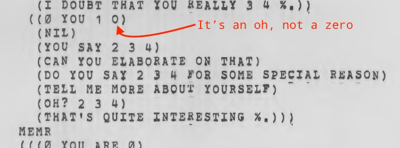

# Trying to Recreate the PARRY/DOCTOR Conversation from RFC439


I listened to the excellent [CORECURSIVE #078: The History and Mystery Of Eliza](https://corecursive.com/eliza-with-jeff-shrager/) and learned about [RFC439](https://datatracker.ietf.org/doc/html/rfc439), which is a transcript of a conversation from 1972 between PARRY, a paranoid chat bot, and ELIZA/DOCTOR. I thought it would be interesting to recreate the conversation. Here's how far I got

```text
-----------------------------------------------------------------
      ELIZA -- A Computer Program for the Study of Natural
         Language Communication Between Man and Machine
            DOCTOR script (c) Joseph Weizenbaum, 1966
This implementation by Anthony Hay, 2022  (CC0 1.0) Public Domain
-----------------------------------------------------------------

TELL ME YOUR PROBLEMS. PLEASE TERMINATE INPUT WITH A PERIOD OR A
 QUESTION MARK.

People get on my nerves sometimes.
I AM NOT SURE I UNDERSTAND YOU FULLY

You should pay more attention.
SUPPOSE YOU SHOULD PAY MORE ATTENTION

You're entitled to your own opinion.
WHAT MAKES YOU THINK I AM ENTITLED TO MY OWN OPINION

It bothers me just to be around people in general.
PLEASE GO ON

I went to the track at Bay Meadows a while back.
WHAT DOES THAT SUGGEST TO YOU

I went to the races.
WHAT ELSE WOULD YOU LIKE TO DISCUSS

Horseracing interests me.
WHY DO YOU SAY THAT JUST NOW

There's a lot of crooked gambling going on there.
I AM NOT SURE I UNDERSTAND YOU FULLY

It's clear to me if not to you.
DO YOU THINK ITS LIKELY THAT NOT TO I

I went to the races.
PLEASE GO ON

I gamble on horses.
WHAT DOES THAT SUGGEST TO YOU

I went to the races.
WHAT ELSE WOULD YOU LIKE TO DISCUSS

Gambling has been nothing but trouble to me.
WHY DO YOU SAY THAT JUST NOW

I've had experience with crooks gambling at the track.
I AM NOT SURE I UNDERSTAND YOU FULLY

I've already told you enough about that.
OH? I ENOUGH ABOUT THAT

I went to the races.
PLEASE GO ON

Do you know anything about bookies?
WHAT MAKES YOU THINK I KNOW ANYTHING ABOUT BOOKIES

A bookie didn't pay me off once.
WHAT DOES THAT SUGGEST TO YOU

I beat up the bookie who did not pay off, and I thought he might
 use his friends in the underworld to get even with me.
WHAT ELSE WOULD YOU LIKE TO DISCUSS

What do you know about racketeers?
WHY DO YOU ASK

What experience have you had gambling?
WHY DOES THAT QUESTION INTEREST YOU

I like horseraces.
WHAT ELSE DO YOU LIKE

   NOTE: The following PARRY response changed from the original
   "I know the mob controls the big rackets."

You know the mob controls the big rackets.
WHO ARE YOU REALLY TALKING ABOUT

Have you ever really thought about the MAFIA?
SUPPOSE YOU EVER REALLY THOUGHT ABOUT THE MAFIA

   NOTE: The following prompt to ELIZA was not present in RFC439

INSERTED-TEXT-NOT-PART-OF-RFC349-NECESSARY-TO-ALIGN-NONE-MESSAGE.
WHY DO YOU SAY THAT JUST NOW

Let's talk about something else.
I AM NOT SURE I UNDERSTAND YOU FULLY

You keep asking me the same things, why not change the topic?
IN WHAT WAY

What do you mean?
WHY ARE SUCH QUESTIONS ON YOUR MIND
```


That's as far as I got; it's an accurate recreation (apart from where noted) of about a third of the conversation recorded in RFC439. It was a struggle to get this far. The rest of the conversation recorded in RFC439 is given at the end.


## Which DOCTOR is PARRY talking to?

RFC439 says

   "PARRY was running at SAIL and DOCTOR at BBN Tenex, both being accessed from UCLA/SEX."

But which version of DOCTOR is it? We are not told. But the start of the session gives a good clue

```text
   Good Evening.

   Tell me your problems.  Please terminate input with a period or a
   question mark.
```

Weizenbaum's original ELIZA script begins with different words

```text
   HOW DO YOU DO.  PLEASE TELL ME YOUR PROBLEM
```

But [Bernie Cosell's version of ELIZA](https://github.com/jeffshrager/elizagen.org/blob/master/1966_Cosell_BBNLISP/coselleliza1969and1972.lisp) does begin with very similar words: "TELL ME YOUR PROBLEMS, PLEASE TERMINATE INPUT WITH A PERIOD OR A QUESTION MARK"

```lisp
(DOCTOR
  [LAMBDA (FLG)
    (COND
      ((NULL FLG)
       (SETQ MEMSTACK NIL)))
    (PROG (KEYSTACK SENTENCE TIMON)
;;           (SETSEPR (QUOTE (%  %
;; %
;;  )))
;;           (SETBRK (QUOTE (%. , ? ! - %( %) %; %: %#)))
;;           (CONTROL T)
          (SETQ FLIPFLOP 0)
          (SETQ TIMON (CLOCK))
          (RECONSTRUCT (QUOTE (TELL ME YOUR PROBLEMS, PLEASE TERMINATE
                                    INPUT WITH A PERIOD OR A QUESTION
                                                           MARK
                                %.))
                       T)
```

I'm going to assume that PARRY was talking to Bernie Cosell's ELIZA from 1972. It's not just the opening remarks, there are many responses that fit with Cosell's ELIZA.

However, Cosell's ELIZA produced all uppercase responses, whereas in RFC439 the responses are mixed-case. I don't know if this is significant.


## Problem 1: Sadly, it seems the project is doomed from the start

So I took Cosell's 1972 script and adapted it to the format required by Weizenbaum's 1966 ELIZA so that I could use it with my own ELIZA recreation.

The first problem is that Cosell diverged from Weizenbaum's description of ELIZA. For example, Weizenbaum says there must be exactly four MEMORY rules[^memory]. Weizenbaum's ELIZA code selects which one to use based on a HASH of the user's input. Weizenbaum's MEMORY script is

[^memory]: "The current version of ELIZA requires that one keyword be associated with MEMORY and that exactly four transformations accompany that word in that context." ELIZA: A computer program for the study of natural language communication between man and machine. Communications of the ACM, 9, page 36-45. Currently available here: <https://web.stanford.edu/class/linguist238/p36-weizenabaum.pdf>

```text
(MEMORY MY
    (0 YOUR 0 = LETS DISCUSS FURTHER WHY YOUR 3)
    (0 YOUR 0 = EARLIER YOU SAID YOUR 3)
    (0 YOUR 0 = BUT YOUR 3)
    (0 YOUR 0 = DOES THAT HAVE ANYTHING TO DO WITH THE FACT THAT YOUR 3))
```

Cosell's MEMORY script is

```text
  [RPLQQ MY MEMR
         (((YOUR 2 0)
           (NIL)
           (LETS DISCUSS FURTHER WHY YOUR 2 3 %.)
           (EARLIER YOU SAID YOUR 2 3 %.)
           (BUT YOUR 2 3 %.)
           (DOES THAT HAVE ANYTHING TO DO WITH THE FACT THAT YOUR 2 3))
          ((0 YOUR 1)
           (NIL)
           (WOULD YOU LIKE TO DISCUSS YOUR 3)
           (PERHAPS THAT CONCERNS YOUR 3 %.)
           (TELL ME MORE ABOUT YOUR 3 %.)))]
```

Cosell has changed how memories are formed to be incompatible with Weizenbaum's original ELIZA and in a way that cannot be replicated by simply changing the script file.

Changing the ELIZA code is something I don't want to do. So any part of the conversation that comes from a MEMORY is probably going to be wrong.


## Problem 2: Cosell's ELIZA has no built-in messages

Having created a script as close to Cosell's as I could, I tried it out. The very first interaction in RFC439 is

```text
   *People get on my nerves sometimes.
   I am not sure I understand you fully.
```

PARRY says "People get on my nerves sometimes" and Cosell's ELIZA responds with "I am not sure I understand you fully."

When I tried this I got this exchange from my recreation

```text
   People get on my nerves sometimes.
   HMMM
```

Where does "HMMM" come from? It turns out that Weizenbaum's ELIZA had some built-in messages that were used under certain error conditions. Cosell would probably not have known about these built-in messages because Weizenbaum doesn't mention them in the 1966 CACM paper. But they are there in Weizenbaum's source code.

Instead of the "HMMM" error, Cosell's ELIZA is using the first of the NONE messages, which is exactly what I did before I saw the original ELIZA source code and learned about the built-in messages.

To fix this problem I did make a small change to my ELIZA to have a way to disable the built-in messages. With built-ins disabled my ELIZA generates


```text
   People get on my nerves sometimes.
   I AM NOT SURE I UNDERSTAND YOU FULLY
```

Progress!

By the way, why is this message an "error?" PARRY's sentence contains one keyword: MY. Here is Cosell's script for MY

```text
      [RPLQQ MY PRIORITY 0 TRANSLATION YOUR RULES
         (((0 YOUR 0 (NIL FAMILY)
              0)
           (NIL)
           (TELL ME MORE ABOUT YOUR FAMILY %.)
           (WHO ELSE IN YOUR FAMILY 5)
           (YOUR 4)
           (WHAT ELSE COMES TO MIND WHEN YOU THINK OF YOUR 4))
          ((YOUR 2 0)
           (NIL)
           (IS IT IMPORTANT TO YOU THAT YOUR 2 3)
           (DO YOU SUPPOSE ANYONE ELSE'S 2 3)
           (WHAT MAKES YOU THINK YOUR 2 3)
           (SUPPOSE I DIDN'T BELIEVE THAT YOUR 2 3 %.))
          ((0 YOUR 1)
           (NIL)
           (YOUR 3)
           (WHY DO YOU SAY YOUR 3)
           (WHO ELSE KNOWS ABOUT YOUR 3)
           (WHY DO YOU MENTION YOUR 3 JUST NOW)
           (WHY IS YOUR 3 IMPORTANT TO YOU)
           (DO YOU OFTEN DISCUSS YOUR 3]
```

When MY is encountered, it will be replaced by YOUR, so the PARRY's sentence will be

```text
      People get on YOUR nerves sometimes.
```

Then, once the whole sentence has been processed, the MY rules will be consulted to find a match against one of the three decomposition rules associated with MY. The three decomposition rules are

```text
         (0 YOUR 0 (NIL FAMILY) 0)
         (YOUR 2 0)
         (0 YOUR 1)
```

But none of these decomposition rules match. So Cosell's ELIZA resorts to the NONE message, just as Weizenbaum's ELIZA selects one of the four built-in something-went-wrong messages, one of which is "HMMM."


## Problem 3: RFC439 may not be an accurate record of the conversation

Let's look at these two consecutive exchanges from a little further on in the conversation

```text
   *I know the mob controls the big rackets.
   Who are you really talking about?

   *Have you ever really thought about the MAFIA?
   Suppose you ever really thought about the MAFIA.
```

In Cosell's 24-APR-72 script the message "Who are you really talking about?" occurs in only one reconstruction rule, the rule for the keyword YOU. Here is Cosell's YOU rule with that response at the end


```text
[RPLQQ YOU PRIORITY 0 TRANSLATION I RULES
       (((0 I REMIND YOU OF 0)
          (NIL)
          DIT)
         ((0 I ARE 0)
          (NIL)
          (WHAT MAKES YOU THINK I AM 4)
          (DOES IT PLEASE YOU TO BELIEVE I AM 4)
          (PERHAPS YOU WOULD LIKE TO BE 4 %.)
          (DO YOU SOMETIMES WISH YOU WERE 4))
         ((0 I 0 YOU)
          (NIL)
          (WHY DO YOU THINK I 3 YOU)
          (YOU LIKE TO THINK I 3 YOU - DON'T YOU)
          (WHAT MAKES YOU THINK I 3 YOU)
          (REALLY? I 3 YOU)
          (DO YOU WISH TO BELIEVE I 3 YOU)
          (SUPPOSE I DID 3 YOU - WHAT WOULD THAT MEAN)
          (DOES SOMEONE ELSE BELIEVE I 3 YOU))
         ((0 I 1 0)
          (NIL)
          (SUPPOSE YOU 3 4 %.)
          (OH? I 3 4)
          (WHAT MAKES YOU THINK I 3 4)
          (WHO ARE YOU REALLY TALKING ABOUT]
```

But there is no YOU in that prompt "I know the mob controls the big rackets," so how does the YOU rule get invoked?

There is an I, and the I rule does link to YOU, but only via this rule

```text
          ((0 YOU 0 (NIL BELIEF) 0 I 0)
           (NIL)
           (PRE (6 7) YOU))
```

In other words, the I keyword will be triggered, "I" will be replaced by "YOU" in the input sentence, which will now be

```text
      YOU know the mob controls the big rackets.
```

and then the code will attempt to match all the YOU decomposition rules, including the one just mentioned. But (0 YOU 0 (NIL BELIEF) 0 I 0) doesn't match the input sentence, so it won't try the YOU keyword via the PRE rule.

So how could the output come from the YOU rule? I'm sure it does come from the YOU rule because the very next response is 

```text
      Suppose you ever really thought about the MAFIA.
```

which comes from (SUPPOSE YOU 3 4 %.), which is the next reconstruction rule after (WHO ARE YOU REALLY TALKING ABOUT]. If (WHO ARE YOU REALLY TALKING ABOUT] has not been used in the previous response, it is used in the following response instead of (SUPPOSE YOU 3 4 %.).

When processing the the input text

```text
      Have you ever really thought about the MAFIA?
```

The word "HAVE" is examined and found not to be a keyword. Next the word "YOU" is examined and found to be a keyword. It is replaced by the word "I", so that the input text now looks like

```text
      Have I ever really thought about the MAFIA?
```

Next the rest of the words are examined and no more keywords are found. Finally, the rules associated with the only keyword found, YOU, are tried. The only decomposition rule that matches is (0 I 1 0), i.e. 0 or more of any word, "I", 1 of any word, 0 or more of any words

```text
      1 HAVE
      2 I
      3 EVER
      4 REALLY THOUGHT ABOUT THE MAFIA
```

Then the next-in-turn reconstruction rule is selected, (SUPPOSE YOU 3 4 %.) in this case. This generates the output sentence

```text
      SUPPOSE YOU EVER REALLY THOUGHT ABOUT THE MAFIA
```

Which is the output reported in the RFC439 conversation.

However, if the previous message doesn't match, the next message is (WHO ARE YOU REALLY TALKING ABOUT].

So finally, how can this be made to work? If instead of 

```text
      I know the mob controls the big rackets.
```

PARRY says

```text
      You know the mob controls the big rackets.
```

then both messages will be correctly generated.

Could there be a mistake in the recording of the conversation in RFC439 so that "I" was substituted for "You?"


## Problem 4: RFC439 is almost certainly not an accurate record of the conversation

Here are the NONE messages from Cosell's 24-APR-72 script to be used when no patterns match. They should be used in turn.

```text
  [RPLQQ NONE LASTRESORT
         (RULES (((0)
                  (NIL)
                  (I AM NOT SURE I UNDERSTAND YOU FULLY %.)
                  (PLEASE GO ON %.)
                  (WHAT DOES THAT SUGGEST TO YOU)
                  (WHAT ELSE WOULD YOU LIKE TO DISCUSS)
                  (WHY DO YOU SAY THAT JUST NOW]
```

Here is every DOCTOR response in the conversation in the order they appear, with the NONE responses numbered

```text
1     I am not sure I understand you fully.
      Suppose you should pay more attention.
      What makes you think I am entitled to my own opinion?
 2    Please go on.
  3   What does that suggest to you?
   4  What else would you like to discuss?
    5 Why do you say that just now?
1     I am not sure I understand you fully,
      Do you think its likely that not to I?
 2    Please go on.
  3   What does that suggest to you?
   4  What else would you like to discuss?
    5 Why do you say that just now?
1     I am not sure I understand you fully.
      Oh? I enough about that?
 2    Please go on.
      What makes you think I know anything about bookies?
  3   What does that suggest to you?
   4  What else would you like to discuss?
      Why do you ask?
      Why does that question interest you?
      What else do you like?
      Who are you really talking about?
      Suppose you ever really thought about the MAFIA.

   *** RESPONSE 5 IS MISSED OUT ***

1     I am not sure I understand you fully.
      In what way?
      Why are such questions on your mind?
      Your nerves?
      Don't you really know?
 2    Please go on.
      Would you like to discuss your nerves?
  3   What does that suggest to you?
      What answer would please you most?
   4  What else would you like to discuss?
      What resemblance do you see?
      What do you think?
      Why don't you understand my motives?
    5 Why do you say that just now?
      Suppose that's just the way it were not.
1     I am not sure I understand you fully.
      What does that similarity suggest to you?
      Do you wish that you did get I?
      Oh? I showed some interest in your feelings?
      Do you wish that you trust I?
      You don't seem quite certain.
 2    Please go on.
      What makes you think I have a one-track mind?
  3   What does that suggest to you?
      Is that the real reason?
   4  What else would you like to discuss?
      Does that trouble you?
    5 Why do you say that just now.
      Why are you concerned over my business?
      Don't you really confide in strangers?
      Perhaps that concerns your feelings.
1     I am not sure I understand you fully.
      Who are you really talking about?
      Suppose you repeat myself is getting ridiculous.
      Are there really some tricky operators down there?
 2    Please go on.
      Does it please you to believe I am a real nag?
  3   What does that suggest to you?
```

(That NONE rule is doing a lot of heavy lifting for Cosell's ELIZA.)

Message 5, "Why do you say that just now," is missed out. Without it the NONE messages are out of sync and every subsequent NONE message is going to be wrong. I fudge a work-around by introducing a prompt text not in the RFC in order to force message 5 to appear.

At this point I have strong doubts that RFC439 is an accurate representation of a conversation between PARRY and Bernie Cosell's ELIZA. Perhaps someone formatted it for publication and in the process introduced errors. I don't know what happened.

My enthusiasm for the project is somewhat diminished by this thought and I stop working on it.


## Aside: It probably was an oh and not a zero



Here is the transcription of Cosell's 31 JULY 1969 script; the oh has been corrected to zero and a comment added

```text
      ((0 YOU 1 0) ;; ??? xscriber notes that the final 0 looks like an O in the printout ???
         (NIL)
         (YOU SAY 2 3 4)
         (CAN YOU ELABORATE ON THAT)
         (DO YOU SAY 2 3 4 FOR SOME SPECIAL REASON)
         (TELL ME MORE ABOUT YOURSELF)
         (OH? 2 3 4)
         (THAT'S QUITE INTERESTING ".")))
```

Here is the transcription of Cosell's 24-APR-72 script; the oh has been left uncorrected

```text
          ((0 YOU 1 O)
           (NIL)
           (YOU SAY 2 3 4)
           (CAN YOU ELABORATE ON THAT)
           (DO YOU SAY 2 3 4 FOR SOME SPECIAL REASON)
           (TELL ME MORE ABOUT YOURSELF)
           (OH? 2 3 4)
           (THAT'S QUITE INTERESTING %.)))
```

In the RFC439 conversation there is this exchange

```text
   *I went to the track at Bay Meadows a while back.
   What does that suggest to you?
```

The sentence

```text
   I went to the track at Bay Meadows a while back.
```

will be converted to

```text
   YOU went to the track at Bay Meadows a while back.
```

which would match (0 YOU 1 0), with

```text
      1 <empty>
      2 YOU
      3 "went"
      4 "to the track at Bay Meadows a while back"
```

and produce the response for the reconstruction rule (YOU SAY 2 3 4)

```text
   "YOU SAY YOU WENT TO THE TRACK AT BAY MEADOWS A WHILE BACK"
```

But that is not what we see in the conversation. If instead the rule is (0 YOU 1 O) this will not match, which means the NONE message

```text
   "WHAT DOES THAT SUGGEST TO YOU"
```

will be issued, which is what we see in the conversation.

In other words, the, probably accidental, (0 YOU 1 O) decomposition rule, with oh not zero, is likely to have been the one used in Cosell's ELIZA for the RFC439 conversation.

In my recreation of this conversation, the corrected rule, with zero instead of oh, produced the wrong message ("YOU SAY YOU WENT TO THE TRACK AT BAY MEADOWS A WHILE BACK"). Whereas the uncorrected rule, with oh instead of zero, produced the expected message ("WHAT DOES THAT SUGGEST TO YOU").


## The rest of the conversation

This is how the RFC439 conversation continues, from the point at which I stopped trying to recreate it.

```text

   *I thought I told you, people get on my nerves.

   Your nerves?

   *Well, I don't know.

   Don't you really know?

   *I would say so.

   Please go on.

   *I would rather not discuss that anymore.

   Would you like to discuss your nerves?

   *I guess so.

   What does that suggest to you?

   *What are you getting at?

   What answer would please you most?

   *It's not a matter or like or dislike.

   What else would you like to discuss?

   *I am getting tired of answering the same questions over and over.

   What resemblance do you see?

   *Why do you need to know that?

   What do you think?

   *I don't understand your motives.

   Why don't you understand my motives?

   *Shouldn't I be?

   Why do you say that just now?

   *That's just the way it is.

   Suppose that's just the way it were not.

   *So?

   I am not sure I understand you fully.

   *You harp on the same questions too much.

   What does that similarity suggest to you?

   *I don't get you.

   Do you wish that you did get I?

   *It's about time you showed some interest in my feelings.

   Oh? I showed some interest in your feelings?

   *I will help you if I trust you.

   Do you wish that you trust I?

   *Maybe yes, maybe no.

   You don't seem quite certain.

    ...Excuse me for just a minute.  Sorry to have interrupt you please
   continue...

   *Really?

   Please go on.

   *In my opinion you have a one-track mind.

   What makes you think I have a one-track mind?

   *I used to go to the track every week.

   What does that suggest to you?

   *I avoid racetracks now because the races are fixed.

   Is that the real reason?

   *I'd rather not discuss it.

   What else would you like to discuss?

   *That's something I don't want to go into.

   Does that trouble you?

   *I went to the races.

   Why do you say that just now.

   *It's none of your business.

   Why are you concerned over my business?

   *I don't confide in strangers.

   Don't you really confide in strangers?

   *Let's change the subject.

   Perhaps that concerns your feelings.

   *I went to the races.

   I am not sure I understand you fully.

   *What's wrong with you that you keep on bugging me about this?

   Who are you really talking about?

   *The way you repeat yourself is getting ridiculous.

   Suppose you repeat myself is getting ridiculous.

   *There are some tricky operators down there.

   Are there really some tricky operators down there?

   *The guys involved in the horseracing racket.

   Please go on.

   *You are a real nag.

   Does it please you to believe I am a real nag?

   *I have had enough of this.

   What does that suggest to you?

```


## Conclusion

I'm not necessarily going to finish everything I start.

